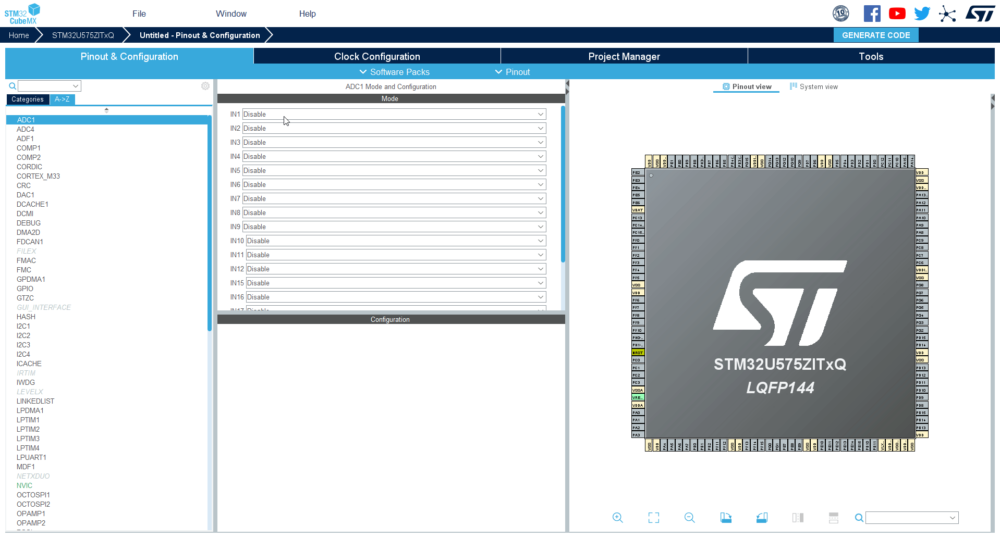
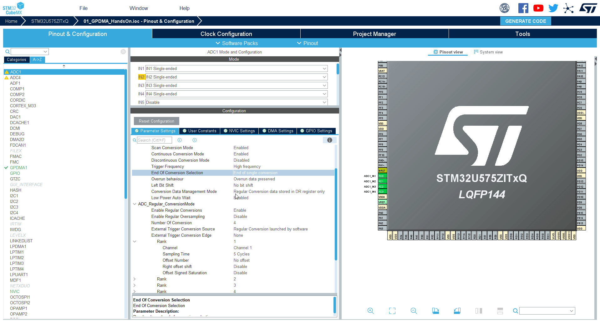
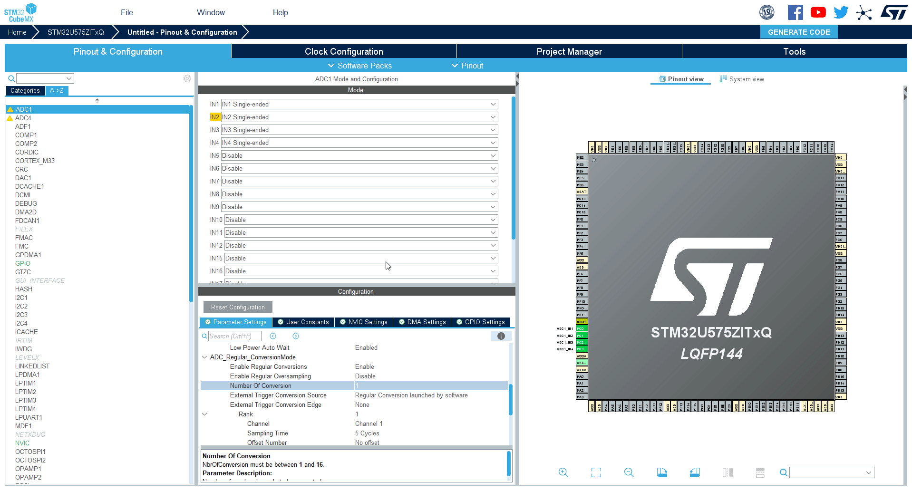
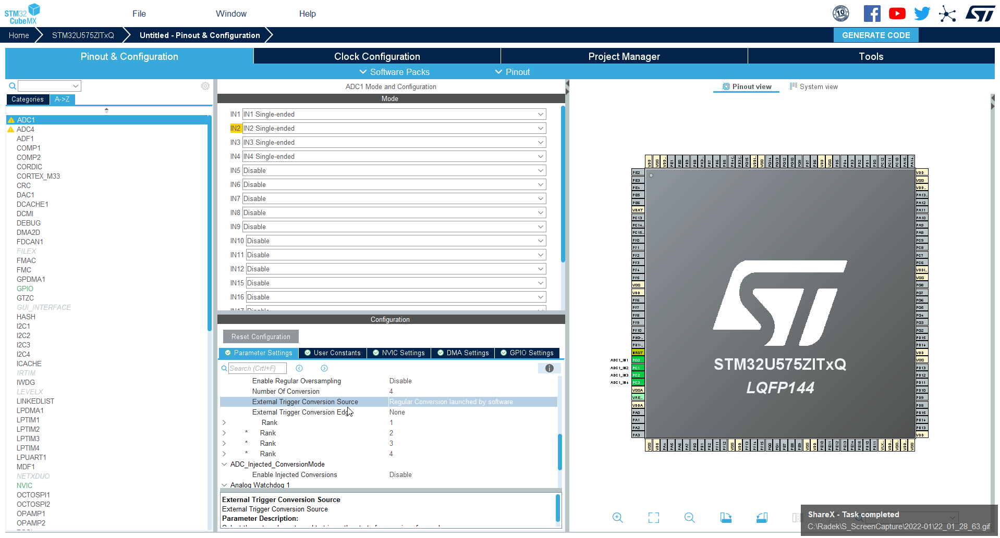
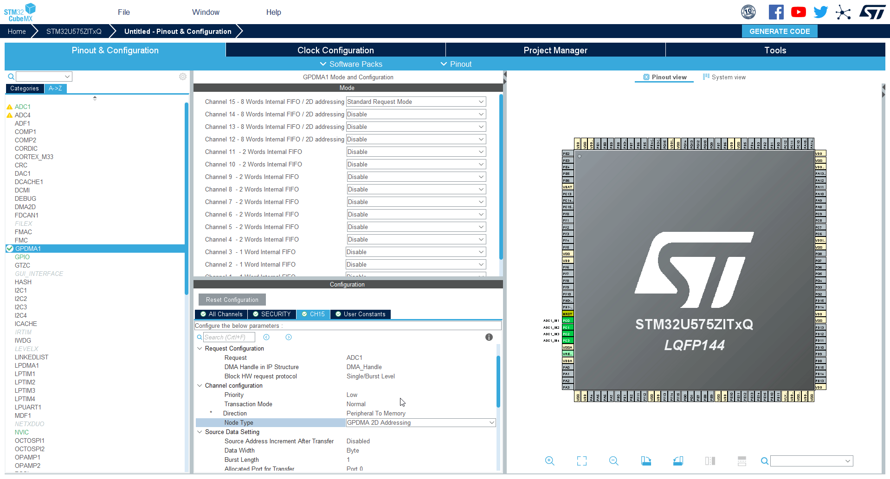
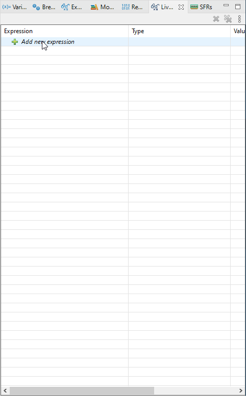

<!-- ----!
Presentation
----! -->

# GPDMA handson copcopysheet 

## 1. GPDMA + ADC

 We create simple example where first GPDMA transfersdata from ADC. 

## 2. TIM + GPDMA + ADC

Then we modify the example that GPDMA is triggered from TIM to start transfering data from ADC

## 3. TIM + GPDMA + ADC + UART

At the end we modify GPDMA again to get data from ADC and when finished to transfer them over UART. 

# GPDMA + ADC

1. Start new project. For STM32U575ZIT
   Description can be found on this [Link](./../utility_config/mx_create_project.md)

# Select ADC1 periphery


# Enable 4 adc channels
Enable channels IN1 to IN4



# Configure the ADC 1/4

1. Set `Continuous conversion mode` to **Enable**

This optiion run ADC in loops. When ADC finish converting all its channesl it will start again from beginning.

2. Set `Low power wait` to **Enable**

This option will stop ADC until the DATA are read form it. It is good to prevent overrun. And we are sure that we have still correct order of channels.

3. Set `Enable Regular Conversions` to **Enable**


# Configure ADC 2/4

1. Set `Conversion Data Management Mode` to **DMA Circular Mode**

After ADC convert value it will create request for DMA. Curcular mode here means that after ADC finish all regular channels it will continue generate DMA request in next run too.


# Configure the ADC 3/4

1. Set `number of conversion` to **4**

This will set ADC to do 4 ADC conversion which we can set.


# Configure the ADC 4/4

1. You can set ADC channel for each `Rank`

Each rank will have assing one ADC channel to convert. It is possible to select same chanel each time.



# Select GPDMA1

1. Sececd GPDMA1
2. Enable channel with 2D addressing (12-15)


# Configure GPDMA1 CH15 1/2

1. Select CH15(or channel which you selected CH12-CH15)
2. Set `Circular Mode` to **Enable**
3. Set `Request` to **ADC1**


# Configure GPDMA1 CH15 2/2

1. Set `Source Data Settings` - `Data Width` to **Half Word**
2. Set `Destination Data Settings` - `Data Width` to **Half Word**
3. Set `Destination Data Settings` - `Destination Address Increment After Transfer` to **Enable**



# Set project name and Generate project and Import to CubeIDE

1. How to generate project is described here [Link](./../utility_config/mx_generate_code.md)
2. Import project to CubeIDE [Link](./../utility_config/ide_import_project.md)

<ainfo>
When used CubeIDE instead of CubeMX to create project no import is needed
</ainfo>

# Create buffer where to store ADC values

We create array `data` of 16bit elements wuth size as `SIZE`which is 64 elements

Like this

```c
#define SIZE 64
uint16_t data[SIZE];
```

Put the array and size to section ` USER CODE BEGIN PV` like bellow

```nc
/* USER CODE BEGIN PV */
#define SIZE 64
uint16_t data[SIZE];
/* USER CODE END PV */
```

# Start ADC and DMA

To start ADC+DMA we can use HAL function `HAL_ADC_Start_DMA`
We use it like this:

```c
  HAL_ADC_Start_DMA(&hadc1, data, SIZE);
```

we put it into section `USER CODE BEGIN 2` like bellow

```nc
  /* USER CODE BEGIN 2 */
  HAL_ADC_Start_DMA(&hadc1, data, SIZE);
  /* USER CODE END 2 */
```

`&hadc1` - is ADC handle which contains information about ADC1 and related DMA channel

`data` - buffer where to store data from ADC
`SIZE` - `data` buffer size 

# Compile code and run debug

1. Run debug [Link](./../utility_config/ide_debug.md)

# In debug open Live Expression

Live expression showing changes in watched variables


# Add variable to live watch



# Run code and check changing content

Fun code by pressing `F8` or press Run 


# How the GPDMA works


