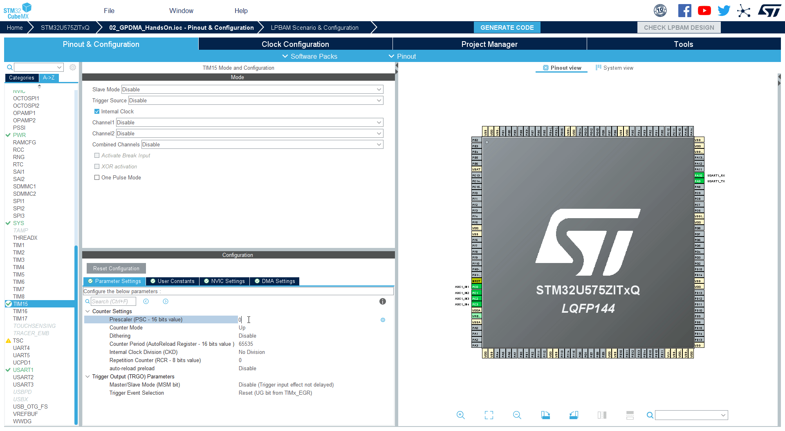

----!
Presentation
----!

# Use trigger

The ADC+UART are now working in loop. This can be wery fast and can also cause a terminal to crash.
But we can slow down the GPDMA by adding trigger.
Then the GPDMA transfer will be conditioned by this trigger event. 


# Trigger source

As trigger source in our case we will use a timer

# Select LINKEDLIST

1. Select `LINKEDLIST`
2. Select first node `YourNodeName`


# Select Trigger

   1. In **Trigger** section for option **Trigger configuration** set `Trigger of selected DMA request on rising edge of the selected trigger input event`
   2. In **Trigger** section for option **Trigger Selection** set `TIM15 TRGO`


# Select  TIM15 & Configure mode 

1. Select `TIM15`
2. Check `Internal Clock`


# TIM15 Configuration

1. Set **Prescaller** to `49999` (real value is 49999 + 1)
2. set **Counter Period** to `79` (4MHZ AHB), or `3199` (160MHz AHB) to get trigger each 1s
3. In **Trigger Outpput (TRGO) Parameters** section for option **Trigger Event Selection** set `Update event`



# Generate code 

1. **Generate code**
2. Go to **CubeIDE**

# Start TIM15

Start TIM15 with `HAL_TIM_Base_Start`

Add 

```c
 HAL_TIM_Base_Start(&htim15);
```

at the end of `/* USER CODE BEGIN 2 */` section

```c-nc
  /* USER CODE BEGIN 2 */
  MX_YourQueueName_Config();

  HAL_DMAEx_List_LinkQ(&handle_GPDMA1_Channel15, &YourQueueName);

  HAL_DMAEx_List_Start(&handle_GPDMA1_Channel15);

  ATOMIC_SET_BIT(huart1.Instance->CR3, USART_CR3_DMAT);

  __HAL_UART_ENABLE(&huart1);

  HAL_ADC_Start(&hadc1);

  HAL_TIM_Base_Start(&htim15);
  /* USER CODE END 2 */
```

# Compile and run code

1. Compile project
2. Run project in debugger

# What we have

we start GPDMA by TIM event. Then GPDMA transfer data from ADC and sent them over UART


