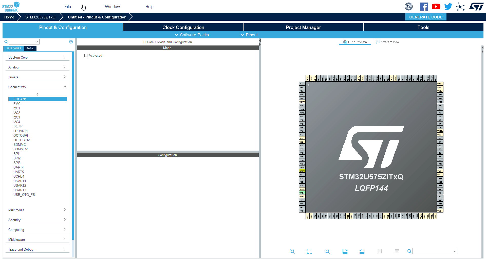
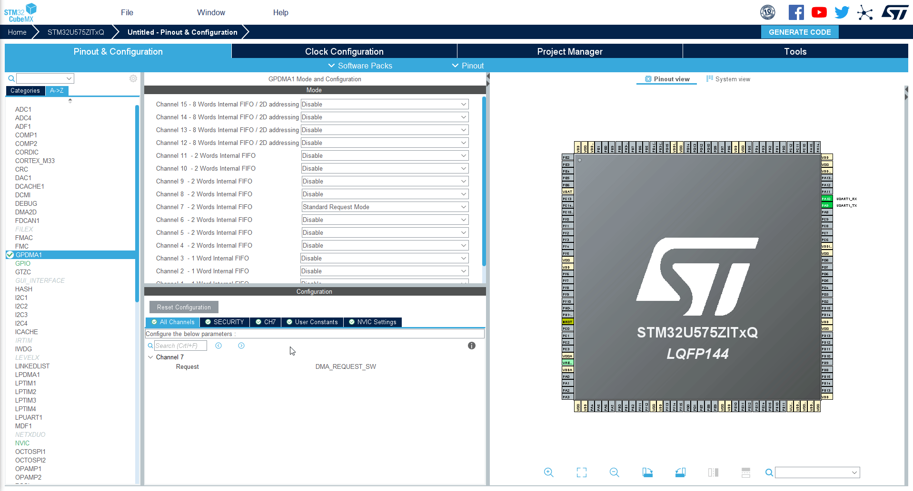
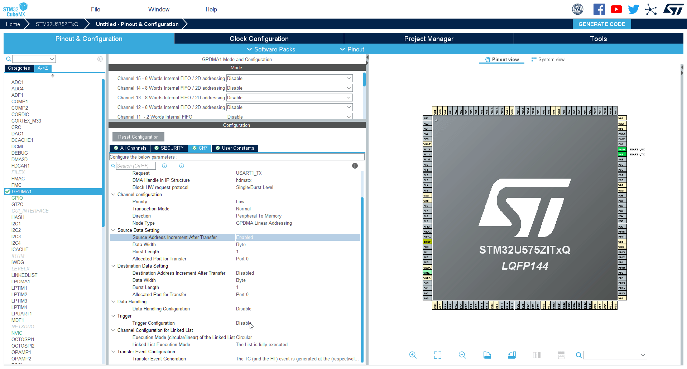

# UART+DMA

We will use GPDAM to automatically send data over UART1. 
When the buffer is full it will trigger the GPDMA which automatically transfer all data. 
This will be used in last handson

# Enable UART1

1. Select `UART1`
2. Select `Asynchronous` mode

3. Check the pins are `PA9` and `PA10`

4. Set baudrate to `115200`

# Set GPDMA

1. Select `GPDMA`
2. Select `Channel 7`
   

3. Select channel 7 - `CH7` tab 

# GPDMA configuration

| Configuration | selected option |
| --- | --- |
| Circulat Mode | Enable |
| Request | UART1_TX |
| Source Address Increment After Transfer | ENABLE
| Trigger Configuration | Trigger of selected DMA request on the frising edge of the selected trigger input |
| Trigger Selection | LPDMA CH1 TCF |

1. Set **Circular mode** to `ENABLE`

2. Set Request to UART_Tx

3. Set **Source Address increment After Trasfer** to `ENABLE`

4. Set **Trigger configuration** to `Trigger of selected DMA request on the frising edge of the selected trigger input`

5. Set **Trigger Selection** to `LPDMA CH1 TCF`

# Save project 

Now we can generate project. 
We will use this part for LPBAM hands on.

