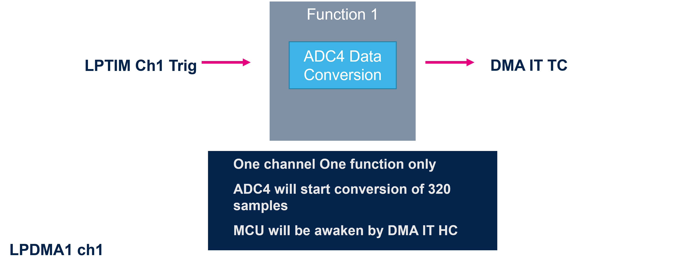

# **Hands On Overview**

## Contents for the LPBAM hands-on can be found at this link
[sharepointlink](https://stmicroelectronics.sharepoint.com/sites/EMEAMCD/Shared%20Documents/Forms/AllItems.aspx?id=%2Fsites%2FEMEAMCD%2FShared%20Documents%2F5%2E%20Promotion%2FWorkshops%2FSTM32U5%5Fworkshop%5F2022%2FMaterial&viewid=5098bdc4%2Dc00e%2D465c%2D9b64%2Dd00de0f5947d)

<awarning>
You might be require to sign in with your ST email and password
</awarning>

In LPBAM Handson we will implement the following scenario making use of **two queues**.
We will use ADC4 and LPTIM1 which are peripherals available in STOP2 into SRD.

- ADC4 conversion will be triggered by LPTIM1 at 256Hz for 1s.
- ADC4 converts data samples that are transferred to SRAM4 by LPDMA in STOP2 mode
- After 1s we change the LPTIM frequency to trigger 64Hz conversion rate for 1s
- LPDMA ch1 will be used for memory to periph transfer and LPDMA ch0 for LPTIM reconfig keeping MCU in Stop2
- Wakeup will happen on DMA TC IT triggered by ADC4 when 320 data words are acquired

<ainfo>
Same application can also run on a single queue, our purpose it to show how to handle multiple LPDMA channels and how complexity is reduced thanks to LPBAM tool configurator intgrated into STM32CubeMx
</ainfo>

---

## Queue 1

 

 ## Queue 2
 

 