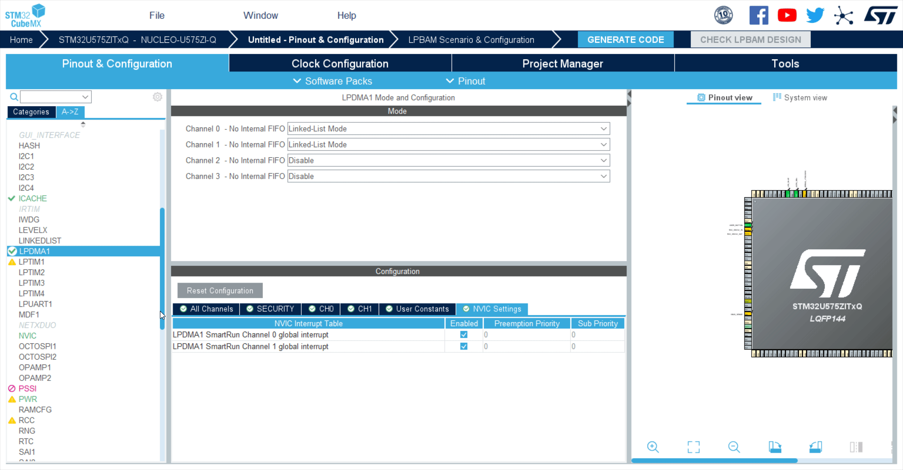
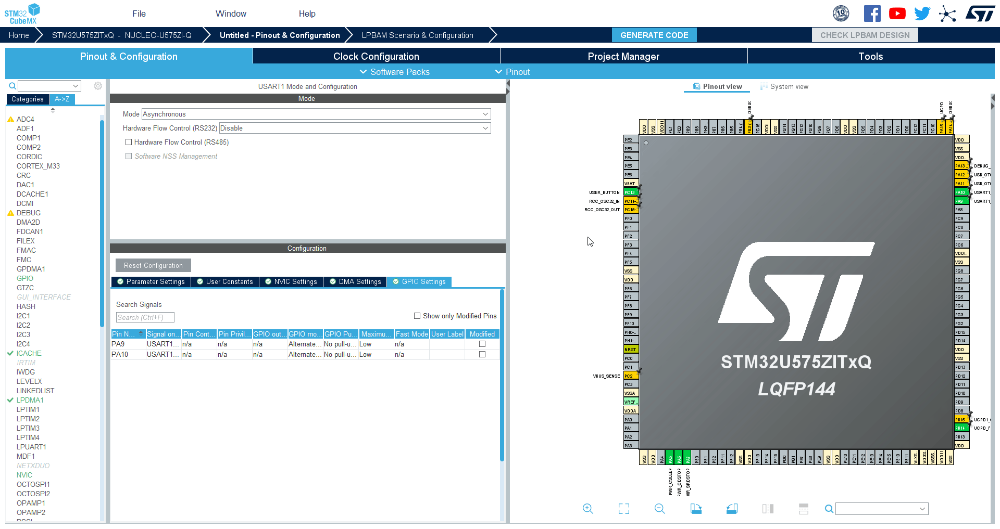

----!
Presentation
----!

# 0- Put in reset state LED RED and LED GREEN,UCPD_DBn and UCPD_FLT from Pinout View 
This will help us to keep lowest power consumption using only essential GPIOs.
We will only use Blue LED and Button to get a visual output and know the power state of MCU

---

# 1- ICACHE

**The instruction cache tends to reduce the number of accesses to the memory, reducing the overall current consumption**

We have to Initialize Cache in 1-way (direct mapped cache).

<awarning>   
Skipping this step will cause a warning later one. 
</awarning>

---

# 2 - LPDMA 

**Two channels will be used respectively for ADC4 sampling and Timer ARR&CNT register updates**

1. Initialize CH0 and CH1 in Linked List Mode
2. Enable interrupts CH1 in NVIC settings
3. Keep all default setting for the other fields

---

# 3 -PWR

**SMPS will be enabled here to achieve best power consumption performance even in run mode**

1. From Debug Pins tab flag select the three options note that PA5,PA6,PA7 appears in GPIO Settings tab 
2. Select SMPS as Power Regulator from Power Saving tab

<ainfo>
Role of PA5,PA6,PA7 will be understood later in this session
</ainfo>

---

# 4 - SYS 

**We will use Systick as system timer**

1. Modify default Timebase Source from TIM17 to Systick

---

# 5 -USART #

**Usart will be used to display ADC data buffer values**

1. Click on USART1
2. Mode=Asyncronous
3. Check that by default GPIOs are PA9,PA10 (these are the ones mapped on STLINK)

---

# 6-DEBUG 

**Set SWD debug pins**

Add SWD debug port from debug tab to avoid need for uncommenting GPIO_Init every time we need to go in low power.

Selected pins by default are PA13, PA14 mapped on STLINK

# 7- CLOCK CONFIGURATION 

We can keep default value with MSIS selected and HCLK @4MHz

----
