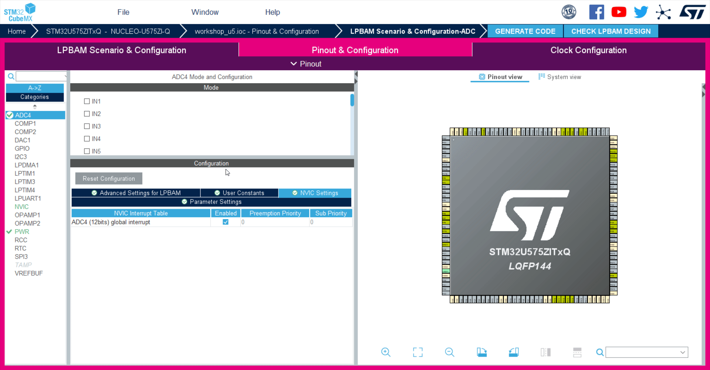

# LPBAM Scenario & Configuration

## Cube Mx 6.5 integrates new tab to easily configure LPBAM peripherals and nodes

   1.Click on the upper tab named 'LPBAM Scanario and Configuration'

   2.Click on + simbol on top left

Let's see how it looks like <!-- here need to be added some nice screenshot with graphic to explain the verious sectionns  -->:

---

# LPBAM Managment #

1. First rename LpamAp1 to something more close to our example e.g. ADC (right mouse clik to perform rename)
2. Change name of Queue1 to Conversion
3. Click on Add Queue, create new queue and name it adc

---

# LPBAM Function Toolbox #

*we will add LPTIM and ADC nodes in LPBAM configuration*

1. Make sure to be on Conversion Queue and not on adc one
2. Select LPTIM1 from the list
3. Click on START and note that one node is added to the chart
4. Click on PWM two times to add two nodes

5. Make sure to move to adc tab 
6. Select ADC4 from the list and Conversion Data

---

# ADC/Scenario/Conversion #

*On the right panel we set circularity configure parameters for LPTIM section*

1. Make sure to be on Conversion Queue and not on adc one
2. Select LPTIM1:Start_1 and change Start mode to continuos Mode
3. Select LPTIM1:PWM_2 and enable period and pulse update state: We used 127 for period and 64 for pulse with repetition counter of 256.
   *NOTE*: Idea is to have 256 repetitions of a square wave at 256Hz meaning 1 second
<!-- need to review this and update to the right period and pulse state -->
4. Click LPTIM1:PWM_3 and enable period and pulse update state. We used 511 for period and 256 for pulse value and put repetition value =64
   *NOTE*: Idea is to have 64repetitions of a square wave at 64Hz meaning 1 second
 <!-- need to review this and update to the right period and pulse state -->

# ADC/Scenario/adc #

*On the right panel we set parameters for the ADC4 sampling*

1. Make sure to be on adc Queue and not on Conversion one
2. On adc tab select transfer complete interrupt Enable
3. Click on ADC4:Conversion_data_x <!-- number here may vary it seems an issue not yet fixed with LPBAM utility -->
4. Provide Data Buffer Name, in our case it will be aData_Sequence1
5. Data Buffer Offset=0
6. Number of Data=320
   
   *NOTE*: Number of Data=320 has been chosen to have the whole buffer filled in 2 seconds
   
<!-- need to check if trigger is needed at this stage -->

# Pinout & Configuration #

## ADC4 ##

*In this step we configure the peripherals available in Smart Run Domain*

1. Click on Top on Pinout&Configuration tab
2. Select ADC4
3. Chose Vref as channel <!--maybe would be better to try out with a different channel to see changes in the data buffer acquired -->
4. On Parameter setting tab choose Sequencer= Sequencer set to not fully configurable
5. Scan Conversio Mode = Forward
6. DMA Continuous Request = Enabled
7. Low Power Auto Wait = Enable
8. SamplingTimeCommon1 = 79.5Cycles <!-- actually we have tried with 160_5 clk cycles but it seems no more an option-->
9. NVIC Settings - Enable ADC4 Global Interrupt
   
   

   ---

   ## LPTIM1 ##

*In this step we configure the LPTIM which is available in Smart Run Domain*

1. Select LPTIM1
2. Mode = Counts internal clock events
3. Channel_1_Active
4. Choose Compare as capture-Compare section
5. Give an arbitrary Period and Pulse <!-- need to check the impact that this number has-->

 

 ---

  ## PWR ##

*We will enable SRAM Power down in Stopmode 1,2,3*

1. Click on PWR
2. Verify that Low Power is set on the upper tab and SMPS is selected as Power Regulator
3. Channel_1_Active
4. Enable power down of all SRAM pages in Stop1,2,
 <!-- need to check if we can also power down other elements-->

 *NOTE*: SRAM4 16KB will not be disabled as it's the only porting available in Stop2

  <!-- once defined, add related .gif-->

 ---

 # Clock Configuration #

*In this step we configure the clock for LPTIM and ADC4 peripherals*

1. Select LSI for LPTIM
2. Verify that ADC4 is clocked with HSI

  *NOTE* RC are powered off in STOP2 and this is visible from the configurator. PLL is also disabled
<!-- not sure makes sense adding a dedicated .gif here -->

 

 # Project Manager #

Let's come back to the Cube MX Project Manager Tab
and enter the following projects settings

1. Give name to your project
2. Click on code generatore and select "Set all free pins as analog"
3. Click on generate code
4. Open Project and switch to Cube IDE

<!-- maybe we should add here a .gif -->

