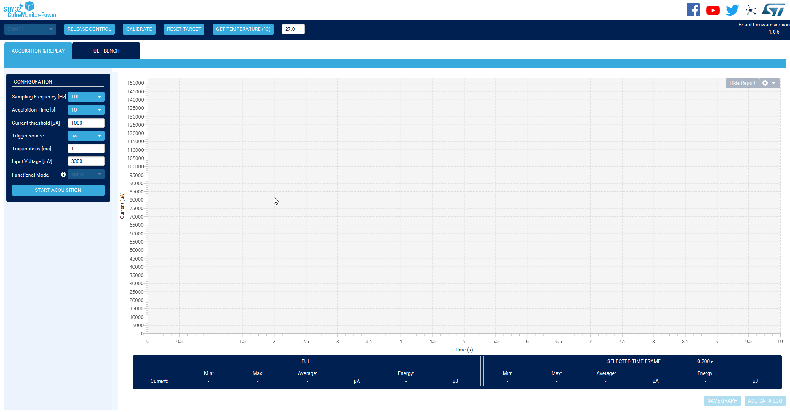
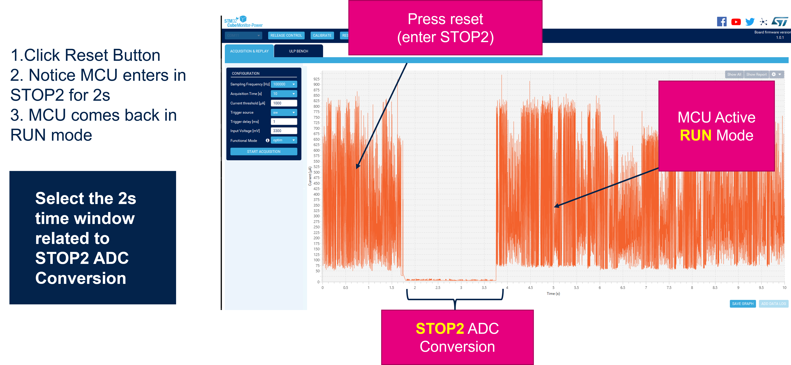
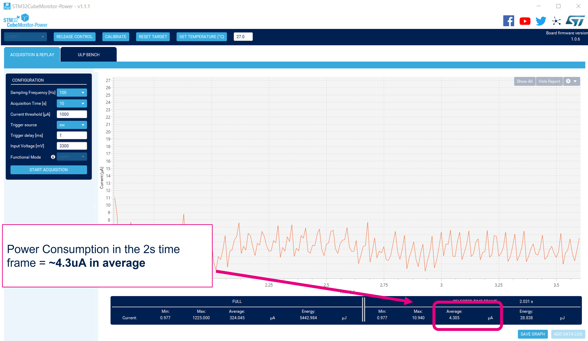
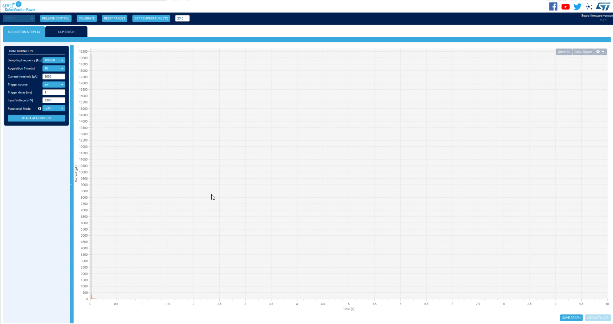
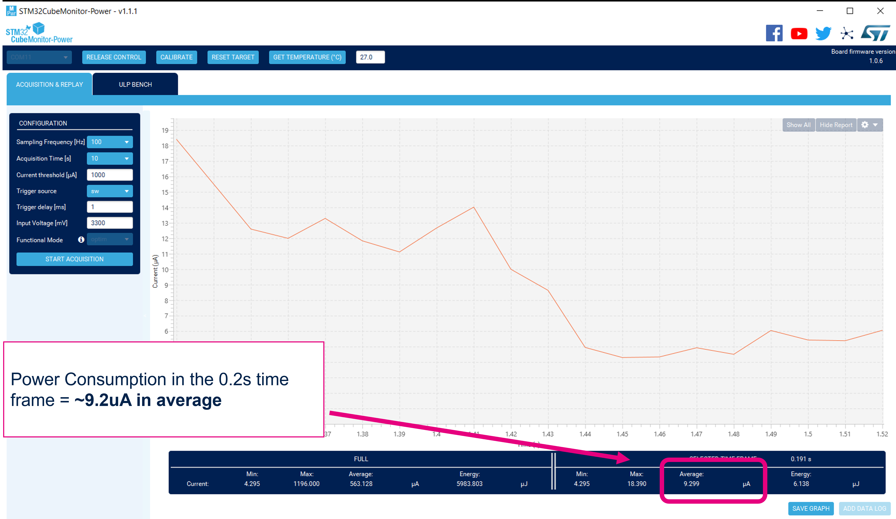
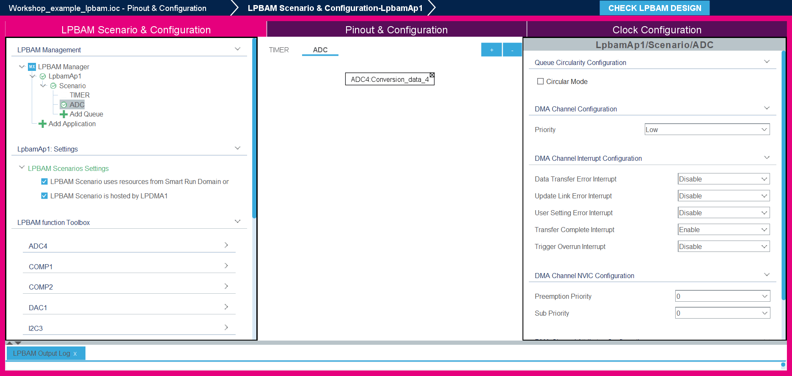

----!
Presentation
----!

# Power Measurement

We will now measure power consumption using **STM32L562E-DK** and **STM32 Cube Monitor Power**


# 1 Board Switch and jumper config settings


# 2 Board connection to Nucleo-U575ZIQ
<ainfo>
CN20 is on the reverse side of the board
</ainfo>
<p


</p>>


# 3 STM32CubeMonitor-Power settings


# 4  Power measurement

<awarning>
If Nucleo-U575 is no more connected and does not reset, reconnect jumper to JP5 and run a new power cycle
</awarning>
<p


</p>>



# 5 Power sequence




# 6 LPBAM Power consumption result


<ainfo>
This power consumption is truly remarkable we will compare it with an application in which LPBAM is not used
</ainfo>

---

# 7 MSIK Frequency change

 In lpbam_lpbamp1_config.c go to function `MX_SystemClock_Config` and modify both MSI and MISK Clock ranges assigning Range 1 which means 24MHz

 ```c
RCC_OscInitStruct.MSIClockRange = RCC_MSIRANGE_1;
RCC_OscInitStruct.MSIKClockRange = RCC_MSIKRANGE_1;
 ```

----

Open `Cube Monitor Power` and run again the measurement - we should notice that results is quite unchanged


<p>


</p>




<ainfo>
This is a very important point: we have changed clock speed by a factor x6 for but power consumption has not changed.
This happens because ADC will be clocked by a high frequency clock but DMA transfer will happen still at LPTIM frequency
</ainfo>

<p>

</p>

# 8 ADC Sampling Frequency change

We now try to modify ADC sampling frequency to check power consumption changes when sampling frequency is increased bya  factor 10x.

In lpbam_lpbamp1_scenario_build.c go to function `MX_TIMER_Q_Build` modify sampling  `TIMER queue PWM_2 build` as follows.

<awarning>
We only need to modify Period and Pulse values, all remaining setting should not vary

</awarning>

```nc
  pPWMFull_LPTIM.PeriodValue = 12;
  pPWMFull_LPTIM.PulseValue = 6;
```

and `TIMER queue PWM_3 build` in the following way:

```c
  pPWMFull_LPTIM.PeriodValue = 51;
  pPWMFull_LPTIM.PulseValue = 25;
```
We also want to come back to initial setting with MSIK=4Mhz

In lpbam_lpbamp1_config.c go to function `MX_SystemClock_Config` and modify both MSI and MISK Clock ranges assigning Range 1 which means 24MHz

 ```c
RCC_OscInitStruct.MSIClockRange = RCC_MSIRANGE_4;
RCC_OscInitStruct.MSIKClockRange = RCC_MSIKRANGE_4;
 ```

Let's now measure power consumptions:



<p>


</p>



<ainfo>
Important to note that as expected consumption variation is around 30% by increasing sampling frequency of a factor 10x.
We will compare this number vs the application w/o LPBAM in Benachmark chapter
</ainfo>

---

# 9 SMART RUN DOMAIN RUNNING MODE

We would now like to see the impact of clock gating meckanism of the autonomous peripheral.
We can enable the SRD always on in stop2.
To do so you need to reoped .ioc file and go to **LBAM Scenario&Configuration**




in our code inside `lpbam_lpbamap1_config.c` in `MX_SystemPower_Config` was changed the following function from `PWR_SRD_DOMAIN_STOP` to PWR_SRD_DOMAIN_RUN :

```nc
/* Smart Run Domain Config*/
HAL_PWREx_ConfigSRDDomain(PWR_SRD_DOMAIN_RUN);
```

We now measure power consumption. We notice that averege power consumption during STOP2 goes into **~25uA** range


<asuccess>
We demostrated the impact on power consumption of peripherals autonomous clock request capability
</asuccess>

