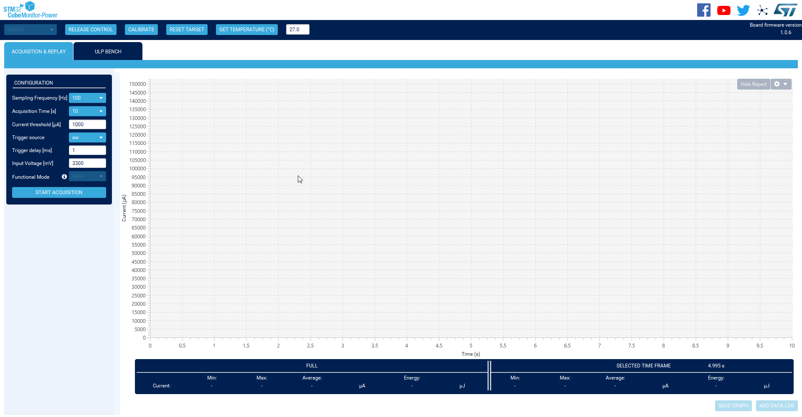
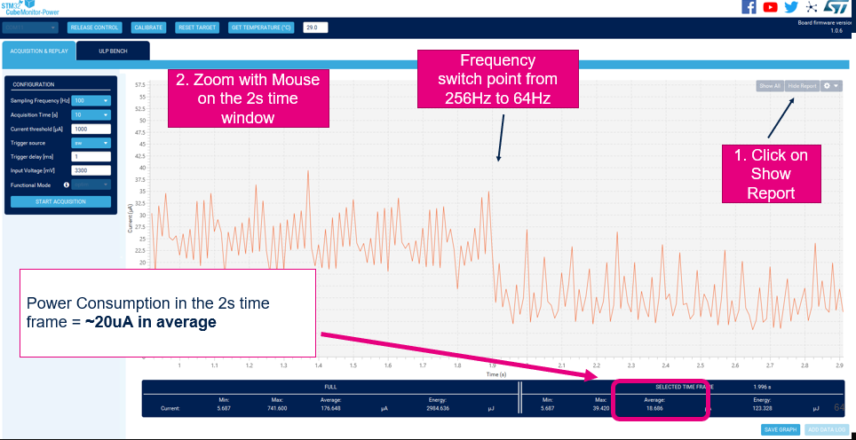

----!
Presentation
----!

# 1- Benchmark with standard application w/o LPBAM

We now need to compare low power result of LPBAM application vs standard approach interrupt based. 

Here below you can see the example of an application which is performing same task without LPBAM.

As for the LPBAM example, **ADC4** is set at **1.5Clk** cycles sampling and **4MHz** MSIK.

**LPTIM** is still changing frequency between **256Hz** and **64Hz** and it is powered by **LSI**

---

<ainfo>
Of course there are many more possible scenario to achieve same result, this is only first example.

We will extend the applicabilty of our findings in next chaper on results discussion.
</ainfo>

<awarning>
Source code of this benchmark application can be downloaded at the below link
We will anyway use .bin to be quicker

[sourcecode](https://stmicroelectronics.sharepoint.com/sites/EMEAMCD/Shared%20Documents/Forms/AllItems.aspx?id=%2Fsites%2FEMEAMCD%2FShared%20Documents%2F5%2E%20Promotion%2FWorkshops%2FSTM32U5%5Fworkshop%5F2022%2FMaterial%2FMaterial%5FLPBAM%5Fhandson%2Fttt%5Fworkshop%5Finterrupt%5Fexample%2Ezip&parent=%2Fsites%2FEMEAMCD%2FShared%20Documents%2F5%2E%20Promotion%2FWorkshops%2FSTM32U5%5Fworkshop%5F2022%2FMaterial%2FMaterial%5FLPBAM%5Fhandson)

</awarning>

---

# 2- Cube IDE Project Build

## .bin of Application used for benchmark can be found here on [sharepoint](https://stmicroelectronics.sharepoint.com/sites/EMEAMCD/Shared%20Documents/Forms/AllItems.aspx?id=%2Fsites%2FEMEAMCD%2FShared%20Documents%2F5%2E%20Promotion%2FWorkshops%2FSTM32U5%5Fworkshop%5F2022%2FMaterial%2FMaterial%5FLPBAM%5Fhandson%2FINTERRUPT%5FADC%5FSamplingFrequencyUpdate%2Ebin&parent=%2Fsites%2FEMEAMCD%2FShared%20Documents%2F5%2E%20Promotion%2FWorkshops%2FSTM32U5%5Fworkshop%5F2022%2FMaterial%2FMaterial%5FLPBAM%5Fhandson)

Once downloaded .bin and file it can be dragged and dropped in NUCLEO-U575 as mass storage:

# 3- Power Measurement

Follow the steps showed in the previous chapter

1 -Connect **STM32L562E-DK** 

2- Open `STM32 Cube Monitor Power`

3- Start the measurement

# 4- Sampling frequency change
We are going to test how this power consumption value changes when sampling frequency increases by a factor 10x

## .bin of Application used for benchmark can be found here on [sharepoint](https://stmicroelectronics.sharepoint.com/sites/EMEAMCD/Shared%20Documents/Forms/AllItems.aspx?id=%2Fsites%2FEMEAMCD%2FShared%20Documents%2F5%2E%20Promotion%2FWorkshops%2FSTM32U5%5Fworkshop%5F2022%2FMaterial%2FMaterial%5FLPBAM%5Fhandson%2FINTERRUPT%5FADC%5FSamplingFrequencyUpdate%5F10xsampling%2Ebin&parent=%2Fsites%2FEMEAMCD%2FShared%20Documents%2F5%2E%20Promotion%2FWorkshops%2FSTM32U5%5Fworkshop%5F2022%2FMaterial%2FMaterial%5FLPBAM%5Fhandson)

- Drag and drop it into NUCLEO-STM32U575 as seen previously

- Connect Power Monitor and start measurement

<ainfo>
We now move to result discussion in order to compare LPBAM vs interrupt based approach
</ainfo>