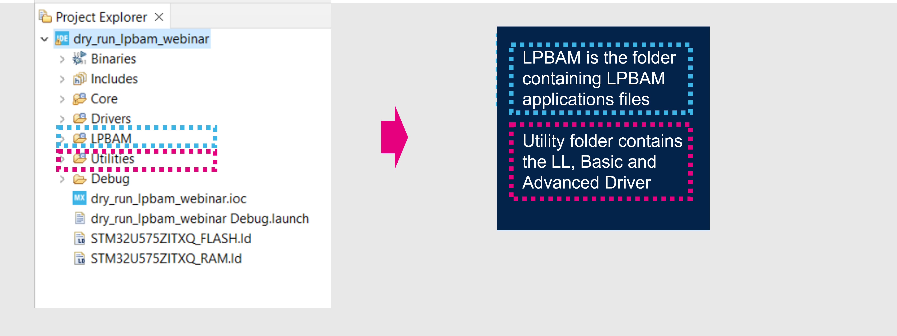
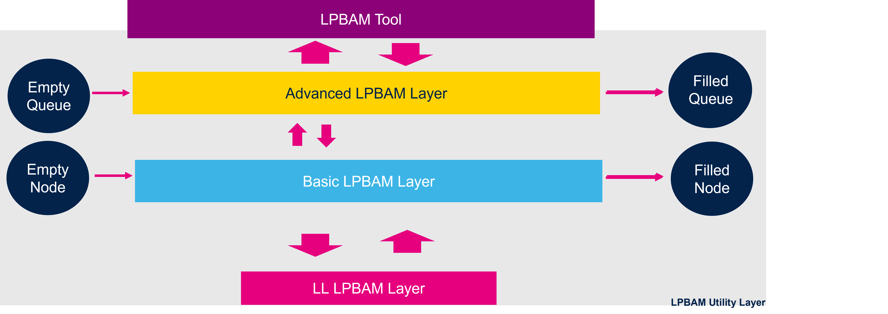
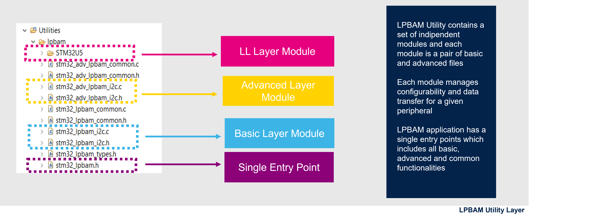
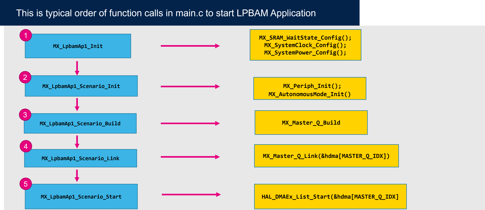
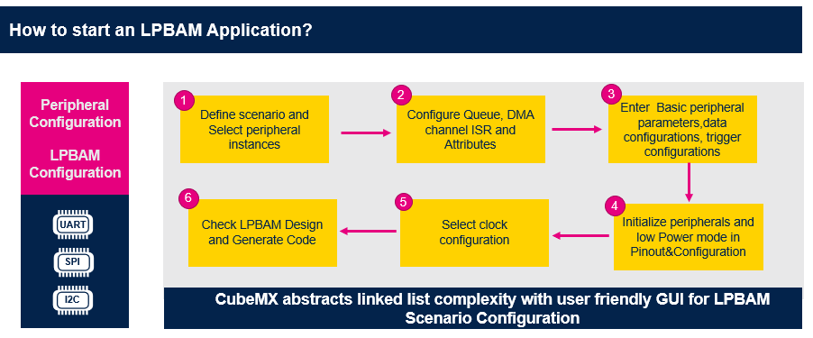

# Generate Code 
We are now going to walk trought the code generated by STM32CubeMX and LPBAM Tool 

# 1- LPBAM Project tree

In project explored we notice that our project includes two new folders 

# 2- STM32Cube U5
Cube MX 6.5.0 integrates LPBAM configurator for STM32U5 thanks to the presence of LPBAM utilities which is a set of modular drivers located  in STM32CubeU5 FW pack.

In the picture below we can see how Utility folder is linked to  CMSIS, DRIVERS, MIDDLEWARE.

LPBAM utility can access all FW Modules. It  can call Driver HAL for GPDMA or drivers of other peripherals

# 3- LPBAM Utility Layer
LPBAM Utility exposes layers or drivers with three level of abstraction, LL Basic and Advanced.

Basic and advanced layer are HW agnostic, instead LL Layer contains device specific configuration for each supported peripheral.

LPBAM tool is built on top of Advanced LPBAM Layer and interacts directly with this Advanced Layer drivers which provides predefined set of function that can be customized to easilty build your low power application.

The first user layer is named Basic LPBAM layer it offers a full granulatiry of scenario creation via transversal API
Advanced layer provides predefined, ready to use scenario, more in detail a set of elementary functions that can be customized and concatenated to build an end-application
The LL layer LPBAM layer is used by the Basic and Advanced LPBAM Layer,
Note that LPBAM tool is a separated layer making use of Advanced LPBAM layer to configure peripherals.

# 3- Utilities folder

# 4- LPBAM Application folder

# 5- LPBAM User Sequence

# 6- Low Level LPBAM Layer

# 7 - LPBAM Tool

