----!
Presentation
----!

# 1 - Definition 
## LPBAM = Low Power Background Autonomous Mode

- **LPBAM** is an operating mode that allows peripherals to be functional and autonomous independently from power modes and without any software running.
- It is performed thanks to a **dedicated** hardware subsystem embedded in the STM32U5 microcontroller.
- It's a **subsystem mechanism** that makes use of DMA to configure features for several pheriperals and transfer data
- An LPBAM task can operate *independently* of device power mode (STOP 0/1/2) and without any software running on CPU thanks to DMA data transactions.
- Asyncronous events/interrupts can be programmed to wake up the system thanks to **autonomous peripherals** (Not all peripheral).
- Automatic start of the peripheral thanks to the hardware synchronous or asynchronous triggers (automated peripheral kernel clock switching).

# 2 - LPBAM Use Cases
## I2C Slave/Master transfer - SPI or UART RX/TX

The first applicative example can be a communication periperals like I2C/SPI/UART configured as Master or slave for transmission.

As showed in this example, we can acquire data from the sensor like a gyroscope or an accelerometer periodically waking up on complete or on ISR or for example on TC,HC of DMA using LP timer to trig communication peripheral.

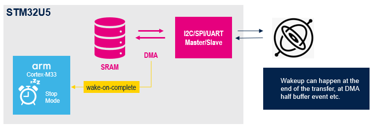

## ADC Conversion triggered by a Low Power Timer
Another typical use case is  Trigger ADC via LPTIM.

<ainfo>
 we will focus on this scenario on our Hands on
</ainfo>

In this case, I can use analog watchdog to wake up the core when I reach a certain threshold- with no data comparison inside DMA this is a good way to wake up the core.

## DAC Conversion in Sample&Hold
On a similar approach, we can change value of DAC.
This can currently be used only in S&H using capacitor to keep dac value – as we have a capacitor, DAC value should be periodically reloaded.
This very suitable low frequency output might be clocked from LSI.

## Voice Activity Detection with Audio Digital Filter
We can handle the transfer in stop2 to and from an analog digital filter (ADF),  waking up if we detect noise or voice.
This is another example of peripheral with embedded comparator that can be used to wake up from stop2.

<ainfo>
This feature is currently not available in CubeMX 6.5.0 but its integration it's planned during 2022
</ainfo>

## LPTIM PWM ratio change, Input Capture, Pulse Counter
On a different scenario, I can also change PWM ratio using an external trigger on a certain threshold still being in STOP2 mode
This is as well a good example on how to create control loops keeping ultra low power consumptions

<info>
We will see this scenario in our practical example
</info>

## LPGPIO Control (Input, Output)
LPGPIO in STOP2 can be read or written. We can build some slow communication protocols such as SPI in this way in a bitbanging mode

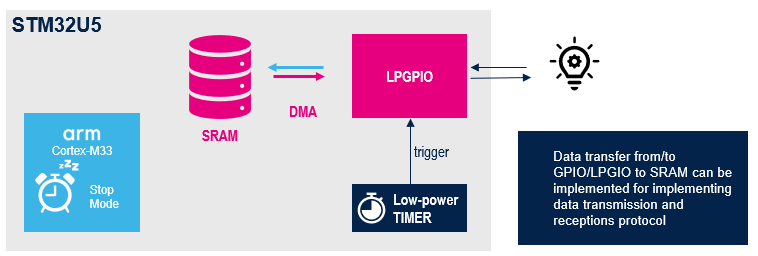

## Peripherals Chaining
This is the most complex and special feature of LPBAM - We can concatenate different peripherals which are active in STOP2 to create peripheral chaining.
For example, we can acquire temperature on periodic way based on LPTIM trigger of an ADC, in our case ADC4.

When temp reaches a certain threshold, we send data on SPI to an external host micro
Analog WDT from ADC can be used as trigger as well and can be used to trigger a data to be sent to a peripheral via SPI

# 3 - System Architecture and DMA Overview
- LPBAM makes use of DMA instance, STM32U5 includes a new DMA IP.
- It integrates all previous DMA features Trigger, DMAMUX MDMA etc.
- We have now a single DMA driver with **two HW instances** which are GPDMA and LPDMA.
- GPDMA and LPDMA can be used in **Linked list mode**.
- GPDMA is on the CPU domain with 2 ports port 0 and port 1, LPDMA is on the Smart Run Domain and has a single port.

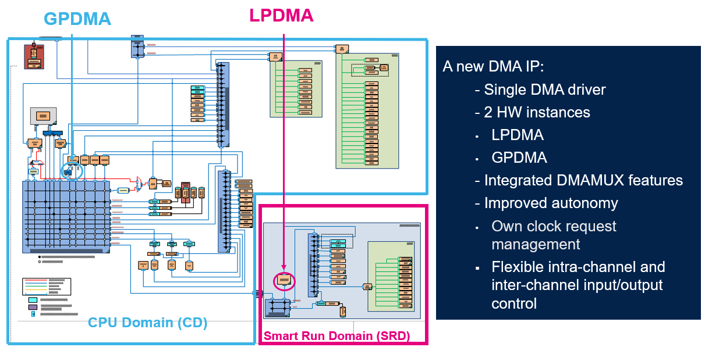

# 4- LPDMA Architecture

- The LPDMA controller is a bus master and system peripheral.
- The LPDMA is used to perform **programmable data transfers** between memory-mapped peripherals and/or memories via **linked-lists**, upon the control of an off-loaded CPU.

During the hands on we will see how LPDMA is configured via CubeMX and LPBAM Scenario&Configurator

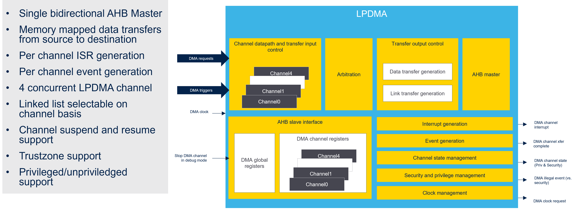

# 5- Smart Run Domain(SRD)
This is a zoom on smartun domain which is a clock domain with 2 masters AHB and LPDMA and 2 slaves which are AHB3Peripehral and internal SRAM4.

<ainfo>
LPDMA can only access smart run peripherals meaning that it can only access to SRAM4 and AHB3 peripherals
</ainfo>

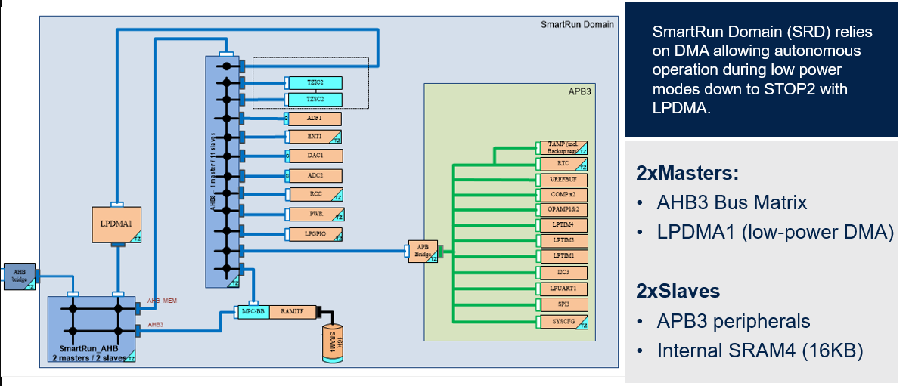

# 6- GPDMA vs LPDMA
Below main differences between GPDMA and LPDMA:

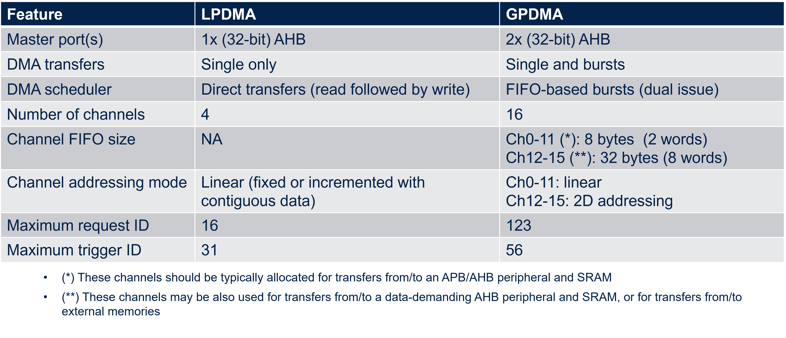

# 7- AHB/APB Distribution over domains

# 8- Clock gating

In LPBAM Peripherals work down to STOP2 mode thanks to their own **independent clock request capability**. 

This is one of the key aspects of LPBAM subsystem mechanism which enables remarkable power saving.

In other MCU we would had to wake up at every DMA transfer complete flag, with LPBAM subsystem this does not happen.

LPDMA HW automatically manages its own **clock gating**, so bus and kernel clocks are requested to RCC only when needed.

This gives great contribution to achieve best optimization of dynamic clock and results into enormous power saving of the overall system.

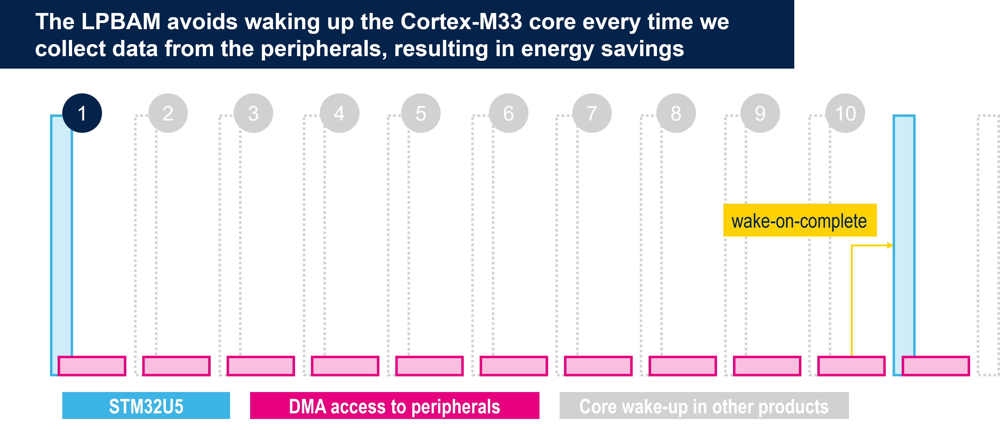

# 9- Clock Distribution in Stop2

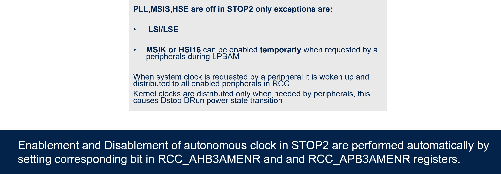

# 10- Pheriperals supporting LPBAM

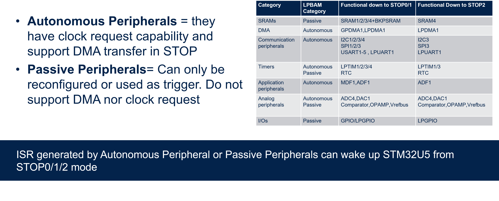

# 11- SRD State transitions

# 12- How to Debug LPBAM Scenario

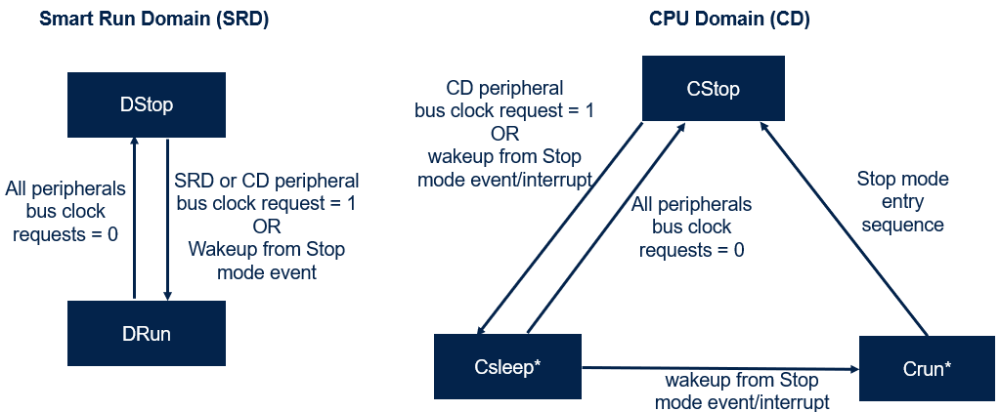

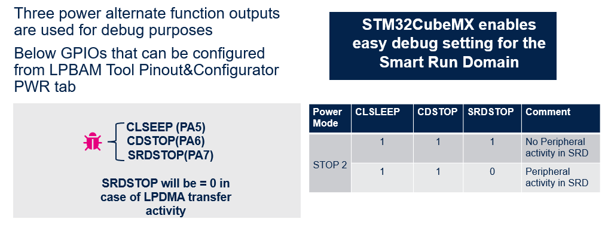

