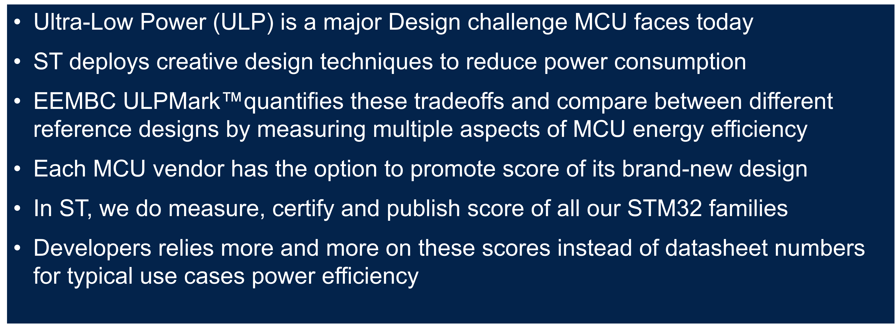
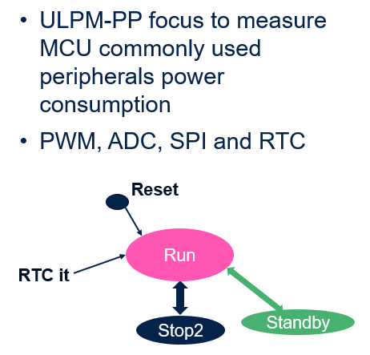
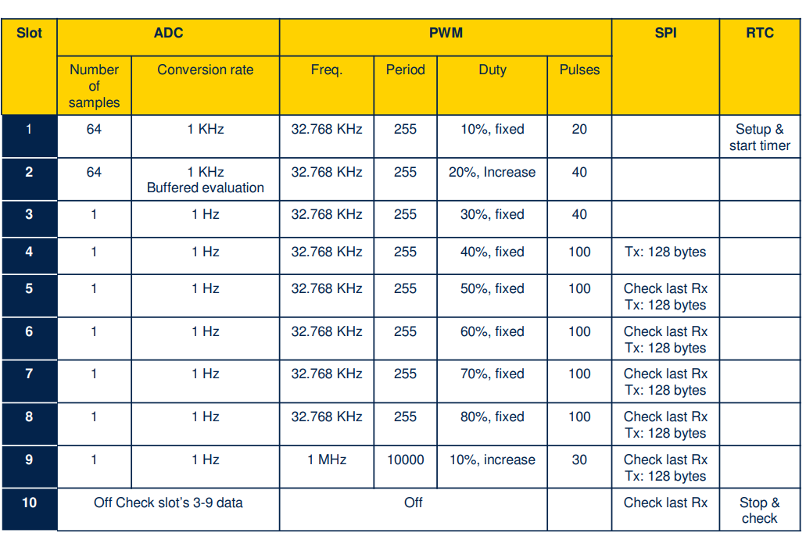

# ULPMark™ overview

## ULPMark™-PeripheralProfile

EEMBC has different stadardized ULP algorithms
We will focus on  **ULPMark-PeripheralProfile** (or -PP for short).

Launched in 2016 examines the energy cost of four
peripherals: real-time clock, pulse-width modulation,
analog-to-digital conversion, and SPI communication

This benchmark defines ten one-second activity slots
each with variable usage of ADC, SPI, PWM, RTC,
allowing the MCU and peripherals to sleep after their
activities have completed.

The table gives an overview of the activity in each slot.
As soon as the device finishes the peripheral operation
for that slot it can enter Standby mode.

This means faster peripherals will most likely score
higher since they can remain off longer.

## Architecture Optimization in STM32U5 vs L5

<ainfo>
Thanks to LPBAM, the ULPMark-PP score of the STM32U5
is drastically increased compared to the STM32L5:

- More than three times when VDD is 3.0 volts
  
- More than 2.5 times when VDD is 1.8 volts.
</ainfo> 

