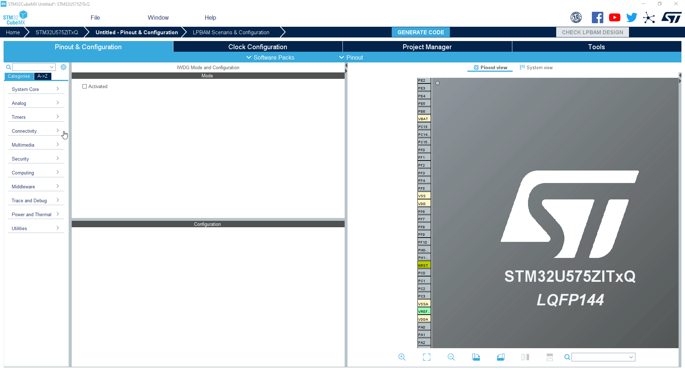

----!
Presentation
----!

# Let's test all tips - Low power HandsOn Scenario
- Tips and tricks how to reducing consumption step by step 

- Enter in Stop mode and periodically wake up by RTC unit

- LED toggling and monitor consumption profile


# CubeMX
1. Open CubeMx or CubeMX plugin in CubeIDE
2. **Access to MCU selector**
3. Select STM32U575ZI
4. Create New project without TrustZone activated
5. Enable **ICACHE 1-way (direct mapped cache)**
6. Configure PC7 (Green LED) as Output Push-Pull. Right click on `PC7` and set as `GPIO_Output`
   


## RTC unit
Application periodically wakeups from Stop mode.

- To do that Wakeup counter of RTC unit is enabled. Keep default LSI as clock source.



LP Stop mode is entered by ` WFI()` instruction. For this reason:

- Enable `RTC non-secure interrupt` in NVIC Setting tab.

- Set `Wake Up clock to 1Hz` base and `set counter to 2` (N-1 seconds must be set).Periodic wake up event occurs each 3 seconds. 


## Project Manager
- Select CubeIDE Toolchain

- Write project name and `Generate Code`
  


# CubeIDE
## Flash linker script
In hands-on we disable Flash Bank 2 and disable data retention in almost all SRAMs. To avoid any HardFault error a correct setup in *linker script STM32U575ZITX_FLASH.ld* is needed.

- Define RAM memory region only for `SRAM4`. Also reduce ROM region to `Flash Bank 1`.

```c
/* Memories definition */
MEMORY
{
  RAM	(xrw)	: ORIGIN = 0x28000000,	LENGTH = 16K
  FLASH	(rx)	: ORIGIN = 0x08000000,	LENGTH = 1024K
}
```
## Comment part of code
In a first part of hands on we don't need GPIO and RTC unit to be activated.
- Commnet following lines:

```c
//MX_GPIO_Init();
//MX_RTC_Init();
```

## Vcore range
<ainfo>
This step is done by CubeMX generator. Proper Vcore level is set dependetly on System clock.
</ainfo>
<p> </p>
Use adequate voltage scaling vs. System clock frequency. Vcore Range 4 replaces STM32L4/L5 Low-power run mode. (<24MHz)

- Enable `Vcore Range 4` in `SystemClock_Config();` function.

```c
(HAL_PWREx_ControlVoltageScaling(PWR_REGULATOR_VOLTAGE_SCALE4)
```

**Measure consumption given by Vcore range in LDO mode**

- Consumption is reduced to aprrox. 470 uA.


## SMPS Vcore supply  
- The SMPS regulator supplies the Vcore Power Domains. Copy paste following code in *Begin 2* user section.

```c
/*The SMPS regulator supplies the Vcore Power Domains.*/
HAL_PWREx_ConfigSupply(PWR_SMPS_SUPPLY);
```

**Measure consumption given by SMPS Vcore supply**

- Consumption is reduced to aprrox. 250 uA.

## Power Down Flash Bank 2
- Enable the Power-down Mode for Flash Bank 2. Copy paste following code in `Begin 2` user section.

```c
/* Enable the Power-down Mode for Flash Banks*/
HAL_FLASHEx_EnablePowerDown(FLASH_BANK_2);
```

**Measure consumption given by Power Down Flash Bank 2**

- Consumption is reduced to aprrox. 175 uA.


## STOP2 mode
To be able observe impact of each further steps let put mcu in Stop 2 mode
- Enter Stop2 mode.

Copy paste following code in `While(1)` user section.

```c
/* Enter Stop 2 Mode */
HAL_PWREx_EnterSTOP2Mode(PWR_STOPENTRY_WFI);
```

**Measure consumption given by Stop 2 mode**

- Consumption is reduced to aprrox. 7.5 uA.

## SRAM retention
- Disable RAM page(s) and caches retention. A content is lost in Stop mode (Stop 0, 1, 2, 3). Copy paste following code in `Begin 2` user section.

```c
/* Disable RAM page(s) content lost in Stop mode (Stop 0, 1, 2, 3) */
HAL_PWREx_DisableRAMsContentStopRetention(PWR_SRAM1_FULL_STOP_RETENTION);
HAL_PWREx_DisableRAMsContentStopRetention(PWR_SRAM2_FULL_STOP_RETENTION);
HAL_PWREx_DisableRAMsContentStopRetention(PWR_SRAM3_FULL_STOP_RETENTION); 
HAL_PWREx_DisableRAMsContentStopRetention(PWR_ICACHE_FULL_STOP_RETENTION);
HAL_PWREx_DisableRAMsContentStopRetention(PWR_DCACHE1_FULL_STOP_RETENTION);
HAL_PWREx_DisableRAMsContentStopRetention(PWR_DMA2DRAM_FULL_STOP_RETENTION);
HAL_PWREx_DisableRAMsContentStopRetention(PWR_PERIPHRAM_FULL_STOP_RETENTION);
HAL_PWREx_DisableRAMsContentStopRetention(PWR_PKA32RAM_FULL_STOP_RETENTION);
```

**Measure consumption given by Disbale SRAM Retention in Stop 2 mode**

- Consumption is reduced to aprrox. 4 uA.

## Ultra low power mode
- Enable ultra low power mode. Copy paste following code in `Begin 2` user section.

```c
/*Enable ultra low power mode*/
HAL_PWREx_EnableUltraLowPowerMode();
```

**Measure consumption given by Ultra low power mode**

- Consumption should be reduced to aprrox. 4 uA.

## Uncomment part of code
In a first part of hands on we don't need GPIO and RTC unit to be activated.
- Commnet following lines:

```c
MX_RTC_Init();
MX_GPIO_Init();
```

## RTC Autonomous mode
- Enable the Autonomous Mode for the RTC Stop0/1/2. RTC is part of Smart Run Domain and dedicated clock enable bit must be set otherwise RTC would not wakeup device from STOP modes. Now device periodically wakeup from Stop2 mode. Copy paste following code in `Begin 2` user section.

```c
/* Enable the Autonomous Mode for the RTC Stop0/1/2*/
__HAL_RCC_RTCAPB_CLKAM_ENABLE();
```

## STOP2 mode with RTC periodic wakeup

- Add Systick delay 3s to be able to measure consumption difference by A-meter

- Set `RTC WakeUp timer` for 3s

- Enter `Stop2 mode`
  
Copy paste following code in `While(1)` user section. 

```c
HAL_GPIO_TogglePin(GPIOC, GPIO_PIN_7);
HAL_Delay(3000);
HAL_GPIO_TogglePin(GPIOC, GPIO_PIN_7);
//Set RTC wakeup timer for 3s 
HAL_RTCEx_SetWakeUpTimer_IT(&hrtc, 3, RTC_WAKEUPCLOCK_CK_SPRE_16BITS, 0);
/* Enter Stop 2 Mode */
HAL_PWREx_EnterSTOP2Mode(PWR_STOPENTRY_WFI);
```

**Measure consumption given by STOP2 mode with RTC periodic wakeup**
  