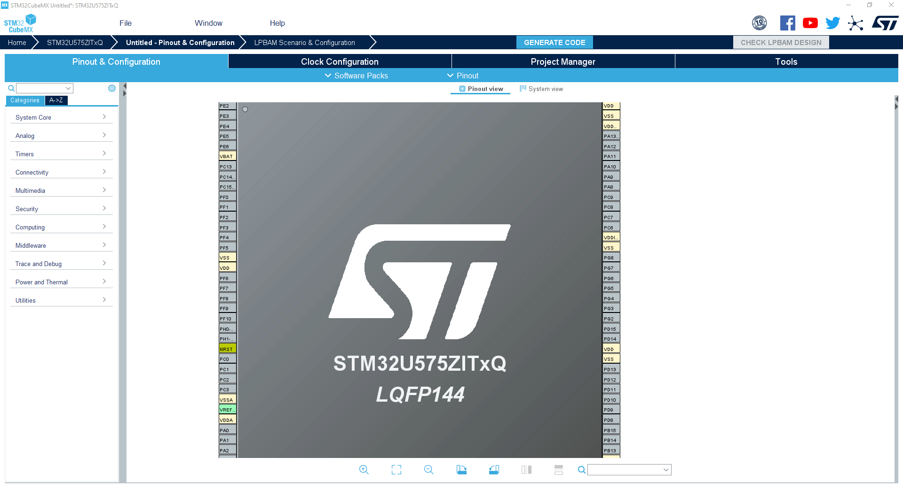
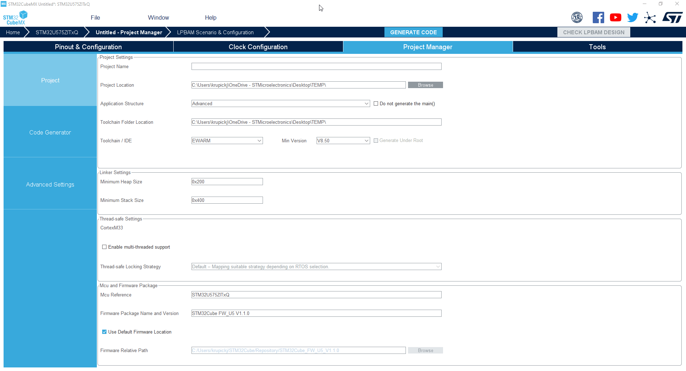

----!
Presentation
----!

# Scenario
- Tips and tricks how to reducing consumption step by step 
- Enter in Stop mode and periodically wake up by RTC unit
- LED toggling and monitor consumption profile

# CubeMX
1. Open CubeMx
2. Select STM32U575ZI
3. Create New project without TrustZone activated
4. Configure PC7 (Green LED) as Output Push-Pull. Right click on `PC7` and set as `GPIO_Output`
   

5. Application periodically wakeups from Stop mode. To do that Wakeup counter of RTC unit is enabled. Keep default LSI as clock source.


6. LP Stop mode is entered by ` WFI()` instruction. For this reason:
Enable RTC non-secure interrupt in NVIC Setting tab.
Set Wake Up clock to 1Hz base and set counter to 2 (N-1 seconds must be set).Periodic wake up event occurs each 3 seconds. 


7. Select CubeIDE Toolchain
Write project name and `Generate Code`.


# CubeIDE
1. In hands-on we disable Flash Bank 2 and disable data retention in almost all SRAMs. To avoid any HardFault error a correct setup in *linker script STM32U575ZITX_FLASH.ld* is needed.

- Define RAM memory region only for `SRAM4`. Also reduce ROM region to `Flash Bank 1`.

```c
/* Memories definition */
MEMORY
{
  RAM	(xrw)	: ORIGIN = 0x28000000,	LENGTH = 16K
  FLASH	(rx)	: ORIGIN = 0x08000000,	LENGTH = 2048K
}
```